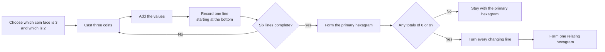

# How to Cast the I Ching With Three Coins

**A complete, transparent tutorial you can read directly on GitHub.**

[中文教程](README.zh-CN.md) · [Method specification](SPEC.md) · [Reference code](src/three-coin.js) · [Try the I Ching three-coin method online](https://ichingreflection.com/how-to-cast/)

The I Ching, or *Book of Changes*, forms a reading from six lines. In the three-coin method, each line comes from one cast of three coins. Six casts build one hexagram from the bottom upward.

This guide shows the complete procedure, the arithmetic behind each line, how changing lines produce a relating hexagram, and how to verify an implementation. You can follow it with physical coins; no code is required.

> The coins form the pattern. A question, interface, animation, AI system, or later interpretation must not select or revise it.

## What you will learn

- how to assign values to three coins;
- why you cast six times;
- how totals `6`, `7`, `8`, and `9` become line states;
- why the first cast belongs at the bottom;
- how to form the primary hexagram;
- how changing lines derive one relating hexagram;
- how to check the method with code and exhaustive tests.

## The I Ching three-coin method at a glance



## Before you begin

You need:

- three two-sided coins;
- paper or a notes app;
- a fixed convention for the two faces;
- enough room to record six lines.

You may hold a question in mind, write it down, or cast without one. The question can guide later reflection, but it is not an input to the calculation.

## Step 1 — Assign `3` and `2`

Before the first cast, choose one face of every coin to mean `3` and the other face to mean `2`.

For example:

```text
chosen face A = 3
chosen face B = 2
```

Physical coin designs differ, and naming conventions vary. What matters procedurally is that you declare the mapping before starting and keep it fixed for all six casts.

## Step 2 — Cast three coins and add them

Cast all three coins together. Replace each face with its assigned value and add the three numbers.

There are only four possible totals:

| Total | Traditional label | Primary line | Changing? | Relating line | Probability |
|---:|---|---|---|---|---:|
| 6 | Old yin | Broken, yin | Yes | Solid, yang | 1/8 |
| 7 | Young yang | Solid, yang | No | Solid, yang | 3/8 |
| 8 | Young yin | Broken, yin | No | Broken, yin | 3/8 |
| 9 | Old yang | Solid, yang | Yes | Broken, yin | 1/8 |

Line shorthand:

```text
6  ━━  ━━  →  ━━━━━   old yin changes to yang
7  ━━━━━               young yang stays yang
8  ━━  ━━              young yin stays yin
9  ━━━━━   →  ━━  ━━   old yang changes to yin
```

Why the probabilities are `1:3:3:1`:

```text
2 + 2 + 2 = 6   one combination
2 + 2 + 3 = 7   three arrangements
2 + 3 + 3 = 8   three arrangements
3 + 3 + 3 = 9   one combination
```

The eight raw outcomes are equally likely when each coin face is unbiased.

## Step 3 — Record the six I Ching lines from bottom to top

The first cast is line 1, the bottom line. Each new line goes above the previous one. The sixth cast becomes the top line.

```text
line 6  ← sixth cast, top
line 5  ← fifth cast
line 4  ← fourth cast
line 3  ← third cast
line 2  ← second cast
line 1  ← first cast, bottom
```

This is not a layout preference. The lower three lines form the lower trigram; the upper three lines form the upper trigram. Reversing the order can identify a different hexagram.

## Step 4 — Repeat until you have six lines

Use a simple worksheet:

| Cast order | Coin values | Total | Line state |
|---:|---|---:|---|
| 1, bottom |  |  |  |
| 2 |  |  |  |
| 3 |  |  |  |
| 4 |  |  |  |
| 5 |  |  |  |
| 6, top |  |  |  |

Complete all six casts before interpreting. Do not redraw a line because you prefer another result.

## Step 5 — Form the primary hexagram

Use the primary polarity of all six totals:

- `6` and `8` are yin;
- `7` and `9` are yang.

Lines 1–3 form the lower trigram. Lines 4–6 form the upper trigram. Together they identify one of the 64 hexagrams.

The primary hexagram preserves the pattern that the six casts actually formed. Changing lines remain part of it; they do not erase it.

## Step 6 — Use changing lines to form the relating hexagram

Only totals `6` and `9` change:

- `6`: yin becomes yang;
- `9`: yang becomes yin.

Totals `7` and `8` remain as they are. If several lines are changing, turn all of them together. Do not silently pick one line as the only result.

The changed six-line pattern is the **relating hexagram**.

If there are no totals of `6` or `9`, there is no relating hexagram to calculate. Stay with the primary hexagram rather than inventing a second pattern.

## A complete I Ching three-coin casting example

Suppose the six totals, recorded from bottom to top, are:

```text
[6, 7, 8, 9, 8, 7]
```

The worksheet becomes:

| Line | Total | Primary | Action | Relating |
|---:|---:|---|---|---|
| 6, top | 7 | `━━━━━` | stays yang | `━━━━━` |
| 5 | 8 | `━━  ━━` | stays yin | `━━  ━━` |
| 4 | 9 | `━━━━━` | changes | `━━  ━━` |
| 3 | 8 | `━━  ━━` | stays yin | `━━  ━━` |
| 2 | 7 | `━━━━━` | stays yang | `━━━━━` |
| 1, bottom | 6 | `━━  ━━` | changes | `━━━━━` |

This produces:

- primary hexagram: 64;
- changing lines: 1 and 4;
- relating hexagram: 41.

The relating hexagram is derived from the changed positions. This procedure does not prove that it is a guaranteed description of the future.

## Try the reference implementation

The repository includes a zero-dependency JavaScript implementation.

```js
import { createCast, resolveReading } from "./src/three-coin.js";

const casts = [
  [2, 2, 2],
  [2, 2, 3],
  [2, 3, 3],
  [3, 3, 3],
  [2, 3, 3],
  [2, 2, 3],
].map(createCast);

const reading = resolveReading(casts.map(({ total }) => total));
console.log(reading);
```

Expected result:

```js
{
  primaryHexagram: 64,
  relatingHexagram: 41,
  changingLines: [1, 4],
  primaryPolarities: ["yin", "yang", "yin", "yang", "yin", "yang"],
  relatingPolarities: ["yang", "yang", "yin", "yin", "yin", "yang"]
}
```

## Verify it yourself

With Node.js 20 or newer:

```bash
git clone https://github.com/Aoyi21/i-ching-three-coin-casting.git
cd i-ching-three-coin-casting
npm test
```

The tests verify:

- all eight raw outcomes of one three-coin cast;
- the `1:3:3:1` distribution of totals `6:7:8:9`;
- all 64 yin/yang patterns against an independent King Wen sequence table;
- all `4^6 = 4,096` combinations of six line states;
- bottom-to-top order and changing-line derivation;
- malformed inputs and the no-changing-lines case.

`4,096` counts combinations of the four possible line states. If every individual coin face is retained, six casts have `8^6 = 262,144` raw outcomes. These are different sample spaces.

## Common mistakes

### Recording the first cast at the top

This reverses the structure. Line 1 belongs at the bottom.

### Treating the relating hexagram as a second draw

It is not drawn again. It is calculated by turning the changing lines already present in the primary hexagram.

### Choosing only a preferred changing line

The procedural result contains every changing position. Interpretation systems may discuss multiple lines differently, but the cast data must preserve all of them.

### Creating a relating hexagram when nothing changes

Six stable lines form a complete primary hexagram. Do not add movement that the coins did not create.

### Letting a question or AI modify the result

A question can frame reflection. It cannot change stored coin values, reorder lines, or select a different hexagram.

## Frequently asked questions

### Which coin face should be `3`?

Choose and declare one face before casting. Different physical coins and guides use different labels. The implementation only requires a stable `2`/`3` mapping across all six casts.

### Can I use physical coins with this repository?

Yes. Record each physical cast as three values, then use the table or `createCast()` to derive the line.

### Is an online cast “valid”?

This repository can verify transparency, ordering, probability, and derivation. It cannot settle a reader’s metaphysical or ritual judgment. A trustworthy digital implementation should at least expose its method and avoid rewriting the result after the cast.

### Does the relating hexagram predict the future?

The code makes no such claim. It only derives a second pattern from the changing lines. How a reader interprets that relationship belongs outside the casting algorithm.

## Method boundaries

- Coin results are the only random input.
- The first cast is always the bottom line.
- Every changing line is preserved.
- No changing lines means no relating hexagram.
- The relating hexagram is derived, not drawn again.
- Questions and interpretations cannot alter the cast.
- This repository contains no user questions, histories, identities, analytics data, or modern copyrighted translations.

## Continue from here

- Read the normative [`three_coin_v1` specification](SPEC.md).
- Inspect the [zero-dependency reference implementation](src/three-coin.js).
- Review the [exhaustive tests](test/three-coin.test.js).
- Follow the visual tutorial and try all six casts at [I Ching Reflection](https://ichingreflection.com/how-to-cast/).

The live experience follows the same boundary: six coin casts form the hexagram first; reflection follows afterward.

## License

Code is available under the [MIT License](LICENSE). Documentation is available under [CC BY 4.0](LICENSE-DOCS).
