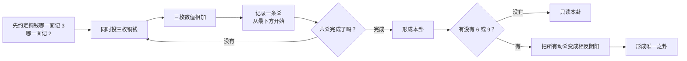

# 如何用三枚铜钱起一卦

**一份可以直接在 GitHub 从头读完的透明教程。**

[English tutorial](README.md) · [方法规范](SPEC.md) · [参考代码](src/three-coin.js) · [在线体验易经三枚铜钱法](https://ichingreflection.com/how-to-cast/)

《易经》用六条爻组成一个卦。三枚铜钱法每次投出一条爻，一共投六次，从下往上形成六爻。

这份教程完整说明每一步怎么算、为什么第一次结果必须放在最下方、动爻怎样形成之卦，以及怎样用代码验证整个过程。只想用实体铜钱也可以，读完前半部分就能独立操作。

> 铜钱先形成卦象。问题、界面、动画、AI 和后来的解释都不能选择或修改结果。

## 读完你会掌握什么

- 怎样给三枚铜钱约定 `3` 和 `2`；
- 为什么需要投六次；
- 总数 `6`、`7`、`8`、`9` 分别是什么爻；
- 为什么初爻必须放在最下方；
- 怎样形成本卦；
- 动爻怎样推导出唯一的之卦；
- 怎样用测试验证计算没有出错。

## 易经三枚铜钱法全流程



## 开始前准备

你需要：

- 三枚双面铜钱；
- 纸笔或手机备忘录；
- 预先确定铜钱两面的数值；
- 可以记录六条爻的空间。

你可以把问题放在心里，也可以写下来，甚至可以不写问题。问题只影响后面的反思角度，不参与起卦计算。

## 第一步：约定 `3` 和 `2`

第一次投掷前，先确定铜钱一面代表 `3`，另一面代表 `2`。

例如：

```text
约定的 A 面 = 3
约定的 B 面 = 2
```

不同铜钱的图案不同，不同资料对正反面的叫法也可能不同。程序上真正重要的是：开始前先约定，六次投掷都保持不变。

## 第二步：投三枚铜钱并求和

三枚铜钱一起投出。按照事先约定换成数字，然后相加。

只会出现四种总数：

| 总数 | 名称 | 本卦爻态 | 是否变化 | 之卦爻态 | 单次概率 |
|---:|---|---|---|---|---:|
| 6 | 老阴 | 阴爻，断线 | 是 | 阳爻，实线 | 1/8 |
| 7 | 少阳 | 阳爻，实线 | 否 | 阳爻，实线 | 3/8 |
| 8 | 少阴 | 阴爻，断线 | 否 | 阴爻，断线 | 3/8 |
| 9 | 老阳 | 阳爻，实线 | 是 | 阴爻，断线 | 1/8 |

用线条表示：

```text
6  ━━  ━━  →  ━━━━━   老阴变阳
7  ━━━━━               少阳不变
8  ━━  ━━              少阴不变
9  ━━━━━   →  ━━  ━━   老阳变阴
```

为什么概率是 `1:3:3:1`：

```text
2 + 2 + 2 = 6   只有一种组合
2 + 2 + 3 = 7   有三种排列
2 + 3 + 3 = 8   有三种排列
3 + 3 + 3 = 9   只有一种组合
```

如果铜钱两面等概率，三枚铜钱一共有八种等可能结果。

## 第三步：按自下而上的顺序记录六爻

第一次投掷是初爻，放在最下方。第二次放在它上面。继续向上，直到第六次成为最上方的上爻。

```text
第六爻  ← 第六次投掷，最上方
第五爻  ← 第五次投掷
第四爻  ← 第四次投掷
第三爻  ← 第三次投掷
第二爻  ← 第二次投掷
初爻    ← 第一次投掷，最下方
```

这不是排版习惯。下三爻形成下卦，上三爻形成上卦。把顺序颠倒，可能会得到另一个卦。

## 第四步：重复到六爻完成

可以直接抄这张记录表：

| 投掷顺序 | 三枚铜钱数值 | 总数 | 爻态 |
|---:|---|---:|---|
| 1，最下方 |  |  |  |
| 2 |  |  |  |
| 3 |  |  |  |
| 4 |  |  |  |
| 5 |  |  |  |
| 6，最上方 |  |  |  |

六次全部完成后再解释。不能因为不喜欢某条爻，就重新投一次替换它。

## 第五步：形成本卦

先取六个总数的原始阴阳：

- `6` 和 `8` 是阴；
- `7` 和 `9` 是阳。

初爻到第三爻形成下卦，第四爻到上爻形成上卦。上下卦组合后，对应 64 卦中的一个本卦。

本卦保留六次投掷实际形成的完整结构。动爻仍然属于本卦，不能因为它会变化就把它删掉。

## 第六步：用动爻形成之卦

只有 `6` 和 `9` 会变：

- `6`：阴变阳；
- `9`：阳变阴。

`7` 和 `8` 保持不变。如果有多条动爻，必须把它们全部变化，不能偷偷只挑自己喜欢的一条。

变化后的六爻结构就是**之卦**。

如果六爻中没有 `6` 或 `9`，就没有需要计算的之卦。此时本卦本身已经完整，不要额外虚构一个变化。

## 一个完整的易经三枚铜钱起卦例子

假设六次总数按自下而上记录为：

```text
[6, 7, 8, 9, 8, 7]
```

逐爻展开：

| 爻位 | 总数 | 本卦 | 动作 | 之卦 |
|---:|---:|---|---|---|
| 上爻 | 7 | `━━━━━` | 阳不变 | `━━━━━` |
| 五爻 | 8 | `━━  ━━` | 阴不变 | `━━  ━━` |
| 四爻 | 9 | `━━━━━` | 动爻 | `━━  ━━` |
| 三爻 | 8 | `━━  ━━` | 阴不变 | `━━  ━━` |
| 二爻 | 7 | `━━━━━` | 阳不变 | `━━━━━` |
| 初爻 | 6 | `━━  ━━` | 动爻 | `━━━━━` |

计算结果：

- 本卦：第 64 卦；
- 动爻：初爻和四爻；
- 之卦：第 41 卦。

之卦来自已经出现的动爻，不是第二次抽取。这个计算过程也不能证明它一定描述未来。

## 用参考代码计算

仓库提供了一份零依赖 JavaScript 实现：

```js
import { createCast, resolveReading } from "./src/three-coin.js";

const casts = [
  [2, 2, 2],
  [2, 2, 3],
  [2, 3, 3],
  [3, 3, 3],
  [2, 3, 3],
  [2, 2, 3],
].map(createCast);

const reading = resolveReading(casts.map(({ total }) => total));
console.log(reading);
```

## 自己运行验证

安装 Node.js 20 或更新版本后：

```bash
git clone https://github.com/Aoyi21/i-ching-three-coin-casting.git
cd i-ching-three-coin-casting
npm test
```

测试覆盖：

- 单次三枚铜钱的全部八种结果；
- `6:7:8:9 = 1:3:3:1` 的组合数量；
- 64 种阴阳结构与独立文王卦序表；
- `4^6 = 4,096` 种六爻状态；
- 自下而上、动爻、之卦、异常输入；
- 无动爻时不生成之卦。

`4,096` 是每爻四种状态形成的组合数。如果保留每一枚铜钱的正反面，六次投掷共有 `8^6 = 262,144` 种原始结果。两者不是同一个样本空间。

## 常见错误

### 把第一次投掷放在最上面

这样会颠倒六爻结构。第一次结果必须是最下方的初爻。

### 把之卦当成第二次抽取

之卦不是再抽一次。它只由本卦中已经出现的动爻推导出来。

### 多条动爻只挑一条

起卦数据必须保留所有动爻。不同解释方法可以讨论阅读重点，但不能篡改原始结果。

### 没有动爻也生成之卦

六条静爻已经形成完整本卦。不能添加铜钱没有产生的变化。

### 让问题或 AI 改变卦象

问题可以帮助反思，但不能修改铜钱数值、调换爻位或重选另一个卦。

## 常见问题

### 铜钱哪一面应该记 `3`？

开始前自行选择并明确即可。实体铜钱和不同资料的叫法可能不同。计算只要求六次投掷都使用同一个 `2`/`3` 约定。

### 可以投实体铜钱，再用这里计算吗？

可以。把每次实体投掷记录为三个数字，然后使用上面的表格或 `createCast()` 计算爻态。

### 在线起卦可信吗？

这个仓库能验证方法是否透明、顺序是否正确、概率和推导是否一致，但它不能替你决定仪式或形而上的判断。一个可信的数字实现至少应该公开方法，并且不能在投掷完成后重写结果。

### 之卦是不是未来？

代码没有这种断言。它只根据动爻推导出第二个关系结构。怎样理解本卦与之卦的关系，属于解释层，不属于起卦算法。

## 方法边界

- 铜钱结果是唯一随机输入。
- 第一次投掷永远是最下方的初爻。
- 所有动爻都必须保留。
- 没有动爻就没有之卦。
- 之卦由动爻推导，不是再次抽取。
- 问题和解释不能改变结果。
- 仓库不包含用户问题、起卦历史、身份、统计数据或现代版权译文。

## 接下来可以看什么

- 阅读严格的 [`three_coin_v1` 方法规范](SPEC.md)。
- 查看[零依赖参考实现](src/three-coin.js)。
- 查看[穷举测试](test/three-coin.test.js)。
- 在 [I Ching Reflection](https://ichingreflection.com/how-to-cast/) 里跟随视觉教程，亲自完成六次投掷。

在线体验遵守同一个边界：先由六次铜钱形成卦象，再进入现代反思。

## 许可

代码使用 [MIT License](LICENSE)。教程文档使用 [CC BY 4.0](LICENSE-DOCS)。
